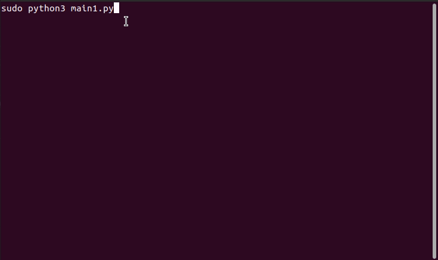

# Анализатор траффика
## Используемые библиотеки
* Scapy
* Subprocess 
## Реализованные функции
* Выбор сетевого интерфейса для сниффинга
* Выбор фильтра для анализа траффика
* Вывод информации, содержащейся в пакетах, в читабельном виде
* Вывод таблицы с IP и MAC адресами устройств в сети
* Удается отключить пользователя (пытался реализовать arp-spoofing но не удается перенаправить пакеты через себя)
  Вот что в настройках роутера, если качестве жертвы устройство с IP 192.168.31.147:
  
## Пример работы

